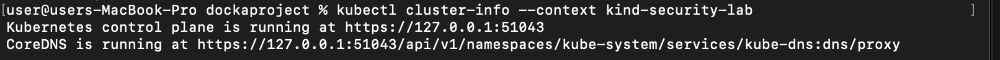
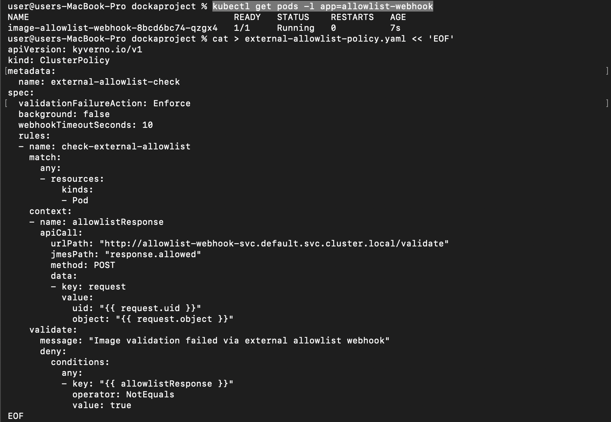
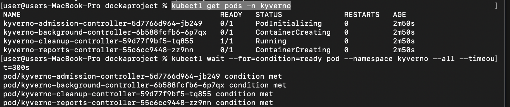
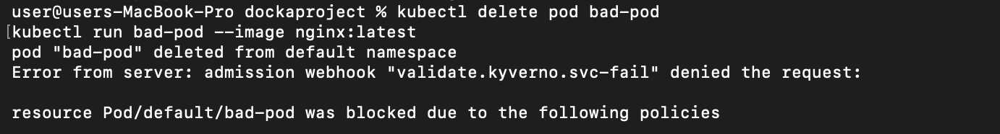
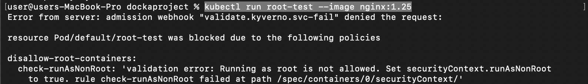
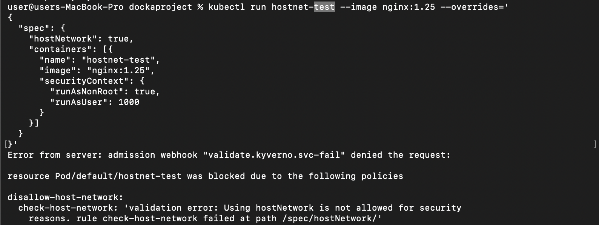
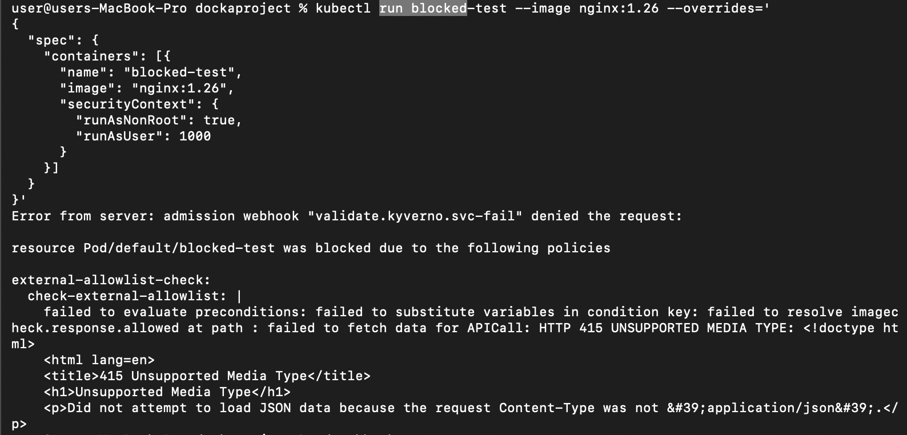
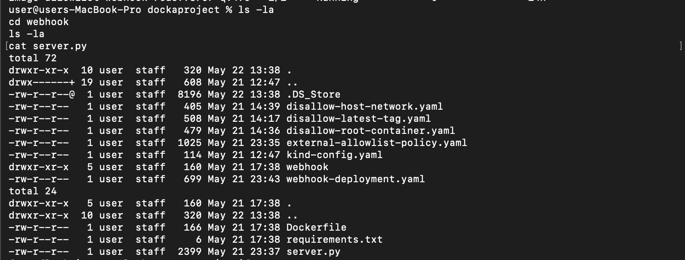

# Kubernetes Admission Controller Security Lab

A hands-on project demonstrating policy-as-code security enforcement in Kubernetes using Kyverno admission controllers and a custom external validation webhook.



---

## 🎯 Project Overview

This project implements a multi-layered security enforcement system for Kubernetes that:

- Blocks insecure pod configurations using Kyverno policies
- Validates container images against an external allowlist via a Python webhook
- Demonstrates shift-left security practices in cloud-native environments
- Runs entirely on a local development machine using `kind` (Kubernetes in Docker)

---

## 🏗️ Architecture

```text
Developer → kubectl → Kubernetes API Server
                          ↓
                Kyverno Admission Controller
                          ↓
          ┌───────────────┴───────────────┐
          ↓                               ↓
   Built-in Policies             External Webhook Policy
          ↓                               ↓
   ✓ No :latest tags              Python Flask API
   ✓ No root containers                   ↓
   ✓ No hostNetwork               Image Allowlist Check
          ↓                               ↓
          └───────────────┬───────────────┘
                          ↓
                 ALLOW or DENY pod creation
```

---

## 🛡️ Security Policies Implemented


### 1. Disallow Latest Tag Policy

- **Purpose:** Prevents deployment of containers using `:latest` or untagged images
- **Rationale:** Ensures version pinning for reproducible deployments and rollback capability
- **Enforcement:** Blocks pods with images lacking specific version tags

---

### 2. Disallow Root Containers Policy

- **Purpose:** Requires all containers to run as non-root users
- **Rationale:** Implements the principle of least privilege and limits the blast radius of container compromise
- **Enforcement:** Requires `securityContext.runAsNonRoot: true` on all containers

---

### 3. Disallow Host Network Policy

- **Purpose:** Prevents containers from sharing the host's network namespace
- **Rationale:** Maintains network isolation and prevents containers from sniffing host traffic
- **Enforcement:** Blocks pods with `hostNetwork: true`

---

### 4. External Image Allowlist Policy

- **Purpose:** Validates container images against an approved list maintained by the security team
- **Rationale:** Centralized governance with dynamic policy updates without redeploying Kyverno
- **Enforcement:** Calls a Python webhook API for image approval



---

## 🧰 Tech Stack

| Technology | Purpose |
|---|---|
| Kubernetes v1.35.0 | Container orchestration |
| Kyverno v1.11.0 | Admission controller & policy engine |
| Python 3.9 | Webhook server |
| Flask | Lightweight webhook API framework |
| Docker | Container runtime and image builder |
| kind | Local Kubernetes cluster |

---

## 📋 Prerequisites

Before starting, ensure you have:

- Docker Desktop installed and running
- `kind` CLI installed
- `kubectl` CLI installed
- Basic Kubernetes knowledge
- macOS, Linux, or Windows environment

---

# 🚀 Setup Instructions

## Step 1: Create Local Kubernetes Cluster

```bash
# Create cluster configuration
cat > kind-config.yaml << 'EOF'
kind: Cluster
apiVersion: kind.x-k8s.io/v1alpha4
nodes:
  - role: control-plane
  - role: worker
  - role: worker
EOF

# Create cluster
kind create cluster --config kind-config.yaml --name security-lab

# Verify cluster
kubectl cluster-info --context kind-security-lab
```

---

## Step 2: Install Kyverno

```bash
# Install Kyverno admission controller
kubectl create -f https://github.com/kyverno/kyverno/releases/download/v1.11.0/install.yaml

# Wait for Kyverno pods to be ready
kubectl wait --for=condition=ready pod --namespace kyverno --all --timeout=300s

# Verify installation
kubectl get pods -n kyverno
```



---

## Step 3: Deploy Built-in Security Policies

### Apply the latest-tag restriction policy

```bash
kubectl apply -f disallow-latest-tag.yaml
```

### Apply the non-root container policy

```bash
kubectl apply -f disallow-root-container.yaml
```

### Apply the host network restriction policy

```bash
kubectl apply -f disallow-host-network.yaml
```

---

## Step 4: Build and Deploy External Webhook

```bash
# Navigate to webhook directory
cd webhook

# Build Docker image
docker build -t image-allowlist-webhook:v1.1 .

# Load image into kind cluster
kind load docker-image image-allowlist-webhook:v1.1 --name security-lab

# Return to project root
cd ..

# Deploy webhook
kubectl apply -f webhook-deployment.yaml

# Verify webhook deployment
kubectl get pods -l app=allowlist-webhook
```

---

## Step 5: Apply External Allowlist Policy

```bash
kubectl apply -f external-allowlist-policy.yaml
```

---

# 🧪 Testing the Policies

## Test 1 — Block `:latest` Tag

```bash
kubectl run bad-pod --image nginx:latest
```

### Expected Result

❌ Blocked with:

```text
Image tag 'latest' is not allowed. Use a specific version tag.
```



---

## Test 2 — Block Root Container

```bash
kubectl run root-test --image nginx:1.25
```

### Expected Result

❌ Blocked with:

```text
Running as root is not allowed. Set securityContext.runAsNonRoot to true
```



---

## Test 3 — Block Host Network Usage

```bash
kubectl run hostnet-test --image nginx:1.25 --overrides='
{
  "spec": {
    "hostNetwork": true,
    "containers": [{
      "name": "hostnet-test",
      "image": "nginx:1.25",
      "securityContext": {
        "runAsNonRoot": true,
        "runAsUser": 1000
      }
    }]
  }
}'
```

### Expected Result

❌ Blocked with:

```text
Using hostNetwork is not allowed for security reasons
```



---

## Test 4 — Block Unapproved Image

```bash
kubectl run blocked-test --image nginx:1.26 --overrides='
{
  "spec": {
    "containers": [{
      "name": "blocked-test",
      "image": "nginx:1.26",
      "securityContext": {
        "runAsNonRoot": true,
        "runAsUser": 1000
      }
    }]
  }
}'
```

### Expected Result

❌ Blocked with:

```text
Image 'nginx:1.26' is not in the approved allowlist.
Allowed: nginx:1.25, alpine:3.18, redis:7.0
```


---

## Test 5 — Allow Approved Image

```bash
kubectl run approved-test --image alpine:3.18 --overrides='
{
  "spec": {
    "containers": [{
      "name": "approved-test",
      "image": "alpine:3.18",
      "command": ["sleep", "3600"],
      "securityContext": {
        "runAsNonRoot": true,
        "runAsUser": 1000
      }
    }]
  }
}'
```

### Expected Result

✅ Pod created successfully



---

# 📁 Project Structure

```text
.
├── kind-config.yaml
├── disallow-latest-tag.yaml
├── disallow-root-container.yaml
├── disallow-host-network.yaml
├── external-allowlist-policy.yaml
├── webhook-deployment.yaml
├── webhook/
│   ├── server.py
│   ├── requirements.txt
│   └── Dockerfile
└── screenshots/
    ├── 01-cluster-info.png
    ├── 02-kyverno-pods.png
    └── ...
```



---

# 🔧 Customizing the Allowlist

Edit the allowlist inside `webhook/server.py`:

```python
ALLOWED_IMAGES = [
    "nginx:1.25",
    "alpine:3.18",
    "redis:7.0",
    # Add approved images here
]
```

Rebuild and redeploy:

```bash
cd webhook

docker build -t image-allowlist-webhook:v1.2 .

kind load docker-image image-allowlist-webhook:v1.2 --name security-lab

cd ..

# Update webhook-deployment.yaml to use v1.2
kubectl apply -f webhook-deployment.yaml
```

---

# 🧹 Cleanup

```bash
# Delete the cluster
kind delete cluster --name security-lab

# Stop webhook container if running locally
docker stop webhook
docker rm webhook
```

---

# 🎓 Key Learnings

## Security Concepts Demonstrated

### 1. Admission Control
Pre-deployment validation catches security issues before workloads reach production.

### 2. Policy-as-Code
Security policies are version-controlled, auditable, and reusable.

### 3. Defense in Depth
Multiple policy layers provide stronger security coverage.

### 4. Shift-Left Security
Developers receive immediate feedback during deployment.

### 5. Principle of Least Privilege
Containers run with minimal privileges by default.

---

## Technical Skills Applied

- Kubernetes admission webhooks
- Kyverno policy creation
- Python Flask API development
- Docker image building
- Kubernetes networking
- YAML policy definitions
- Local Kubernetes environments with `kind`

---

# ⚠️ Challenges Encountered

## Challenge 1 — Kyverno `apiCall` Content-Type Headers

### Problem

Kyverno's `apiCall` context feature does not automatically set:

```text
Content-Type: application/json
```

Flask rejected the requests because of strict content-type validation.

### Solution

Modified the webhook to handle raw request data:

```python
if request.is_json:
    body = request.json
else:
    body = json.loads(request.data.decode('utf-8'))
```

---

## Challenge 2 — Policy Blocking Its Own Webhook

### Problem

The external allowlist policy blocked updates to the webhook deployment itself, creating a circular dependency.

### Solution

Temporarily remove the policy before updating:

```bash
kubectl delete clusterpolicy external-allowlist-check

kubectl apply -f webhook-deployment.yaml

kubectl apply -f external-allowlist-policy.yaml
```

---

# 🔗 References

- [Kyverno Documentation](https://kyverno.io/docs/)
- [Kubernetes Admission Controllers](https://kubernetes.io/docs/reference/access-authn-authz/admission-controllers/)
- [kind Documentation](https://kind.sigs.k8s.io/)
- [MITRE ATT&CK - Container Techniques](https://attack.mitre.org/matrices/enterprise/containers/)

---

# 📝 License

This project is intended for educational and learning purposes.

Feel free to fork, modify, and expand it for your own cloud security practice.

---

# 👤 Author

## Zeteo

- Website: https://zeteosec.com
- LinkedIn: `www.linkedin.com/in/paulayegbusi`

---

> Built for hands-on cloud security learning ☕
````
